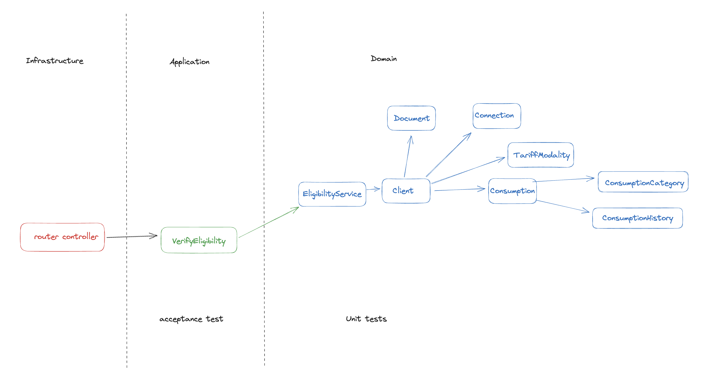

### Getting Started

For running locally:

```bash
yarn install
yarn start:dev
```

For running the tests:

```bash
yarn test:dev
```

for running with docker:

```bash
docker compose up
```

### API Documentation

##### POST /eligibility

body:

```json
{
  "numeroDoDocumento": "string",
  "tipoDeConexao": "string",
  "classeDeConsumo": "string",
  "modalidadeTarifaria": "string",
  "historicoDeConsumo": "number[]"
}
```

response:

```json
{
  "elegivel": "boolean",
  "motivo": "string"
}
```

##### GET /healthcheck

response:

```json
{
  "status": "ok"
}
```

### Architecture

The architecture of this project is based on the Clean Architecture, which is a software architecture that aims to separate the application into layers of concern, isolating the business rules from the rest of the application.

The main layers are:

- **Domain**: This layer contains the business rules and the domain objects. It is the most inner layer of the application and it is isolated from the rest of the application.

- **Application**: This layer contains the application business rules. It is responsible for orchestrating the domain objects and the infrastructure objects.

- **Infrastructure**: This layer contains the infrastructure objects, such as the database, the web framework, the email service, etc. It is the most outer layer of the application and it is isolated from the rest of the application.



### Tests and development workflow

The development workflow is based on the TDD (Test Driven Development) methodology, which consists of writing the tests before writing the code. This methodology helps to keep the code clean and to avoid bugs.

The tests are divided into two categories:

- **Unit tests**: These tests are responsible for testing the business rules of the application. They validate the possible states of each state machine and helps to keep a consistent encapsulations. They are located in the `src/domain/tests` folder.

- **Acceptance tests**: These tests are responsible for testing some scenarios of the application. In this project, the cucumber framework is used to write the acceptance tests. They are located in the `src/acceptance` folder. The scenarios descriptions are written n `.feature` files and the step definitions are written in `.app.spec.ts` files.
